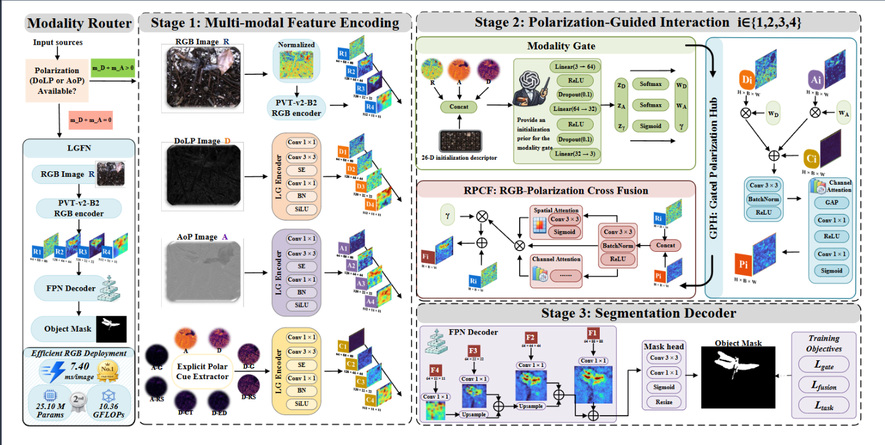
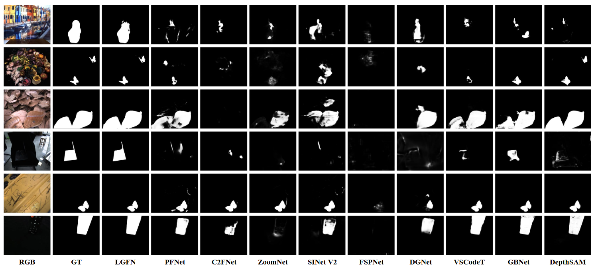
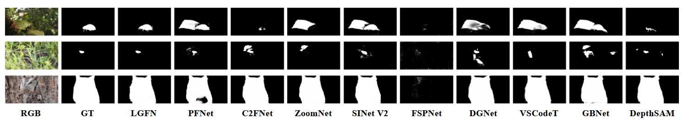
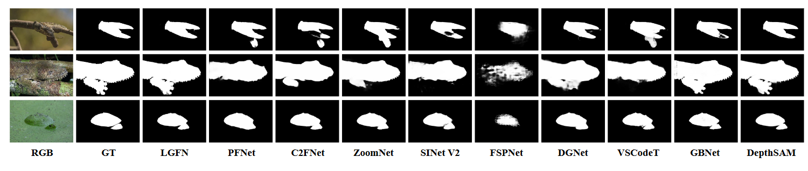
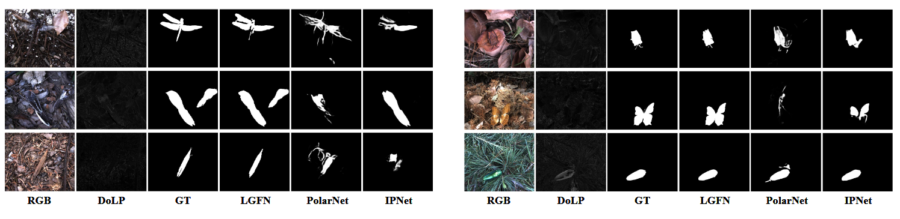
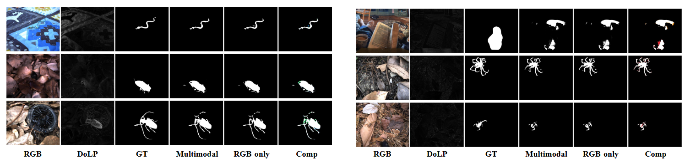

# LGFN: Lightweight Gated RGB–Polarization Fusion with Modality-Availability Conditioning for Camouflaged Object Detection


<p align="center">
  <b>Zhuangfan Huang</b>,
  Xiaosong Li,
  Yang Liu,
  Tao Ye,
  Haishu Tan
</p>

<p align="center">
  <a href="https://arxiv.org/abs/2609.12798">
    
  </a>
</p>

<p align="center">
  <a href="https://arxiv.org/abs/2609.12798">arXiv</a> |
  <a href="#overview">Overview</a> |
  <a href="#network-architecture">Network</a> |
  <a href="#core-modules">Core Modules</a> |
  <a href="#experimental-results">Results</a> |
  <a href="#computational-efficiency">Efficiency</a> |
  <a href="#installation">Installation</a> |
  <a href="#training">Training</a> |
  <a href="#testing">Testing</a>
</p>

---

# Overview

Camouflaged object detection (**COD**) aims to segment objects whose appearance closely resembles that of their surroundings.

Although RGB-based COD methods have achieved substantial progress, they remain primarily dependent on appearance-derived information. When foreground objects and backgrounds exhibit highly similar color and texture characteristics, RGB observations alone may provide insufficient evidence for reliable discrimination.

Polarization imaging provides complementary physical cues related to surface material, reflection, and local geometry. In particular, the degree of linear polarization (**DoLP**) and angle of polarization (**AoP**) can reveal target–background discrepancies that are difficult to distinguish from RGB appearance alone.

We propose **LGFN**, a lightweight gated RGB–polarization fusion framework with **modality-availability conditioning**.

LGFN is designed around three key ideas:

- **Availability-aware inference routing**  
  A deterministic Modality Router selects a separately optimized RGB-only or polarization-assisted configuration according to polarization availability.

- **Polarization-domain coordination before RGB interaction**  
  A Gated Polarization Hub (**GPH**) coordinates learned DoLP/AoP representations together with explicit polarization cues.

- **Controlled RGB–polarization interaction**  
  RGB–Polarization Cross Fusion (**RPCF**) injects coordinated polarization information into the RGB hierarchy through attention-refined residual interaction.

The framework preserves RGB as the principal representation pathway while using polarization as controlled complementary physical evidence.

---

# Network Architecture

<p align="center">
  
</p>

<p align="center">
  <b>Fig. 1. Overall architecture of the proposed LGFN.</b>
</p>

LGFN contains two independently optimized inference configurations.

## RGB-only Configuration

```text
Polarization unavailable
        ↓
RGB-only configuration
        ↓
PVT-v2-B2 + FPN Decoder
        ↓
Camouflaged Object Mask
```

## Polarization-Assisted Configuration

```text
RGB + available polarization inputs
        ↓
Multimodal configuration
        ↓
Modality Gate
        ↓
Gated Polarization Hub (GPH)
        ↓
RGB–Polarization Cross Fusion (RPCF)
        ↓
FPN Decoder
        ↓
Camouflaged Object Mask
```

The deterministic Modality Router selects the corresponding configuration according to the modality-availability vector:

```text
m = [1, m_D, m_A]
```

where:

```text
m_D = availability of DoLP
m_A = availability of AoP
```

When no polarization input is available, LGFN directly executes the RGB-only configuration without using polarization-specific components.

---

# Core Modules

## Modality Router

The Modality Router provides system-level configuration selection according to polarization availability.

The routing rule is:

```text
m_D + m_A = 0  → RGB-only configuration
m_D + m_A > 0  → multimodal configuration
```

The two configurations are independently optimized and stored as separate checkpoints.

This design avoids unnecessary polarization-specific computation when only RGB input is available.

---

## Modality Gate

The availability-conditioned **Modality Gate** controls the relative contribution of the available polarization branches.

Its input is only the modality-availability vector:

```text
m = [1, m_D, m_A]
```

The Gate predicts:

```text
w_D     : DoLP allocation weight
w_A     : AoP allocation weight
gamma   : overall polarization injection strength
```

The polarization weights are normalized over the available polarization branches.

The Gate therefore performs **availability-conditioned global calibration** rather than image-wise polarization-quality estimation.

No sample-dependent image statistics or handcrafted quality descriptors are required during inference.

---

## Explicit Polarization Cues

In addition to learned DoLP and AoP representations, LGFN explicitly extracts source-level polarization structures.

The explicit cue tensor contains information derived from:

- DoLP
- AoP
- DoLP gradient
- AoP gradient
- DoLP local residual
- AoP local residual
- Maximum polarization gradient response
- Maximum polarization residual response

A lightweight cue encoder transforms these source-level cues into multi-scale feature representations.

These explicit structures help preserve local boundaries, texture differences, and polarization-sensitive material responses that may be weakened during hierarchical feature encoding.

---

## Gated Polarization Hub (GPH)

GPH coordinates heterogeneous polarization information **before** interaction with the RGB hierarchy.

At each feature scale, the coordinated polarization representation is constructed from:

```text
DoLP feature
+
AoP feature
+
Explicit polarization cue feature
```

under the allocation weights predicted by the Modality Gate.

Conceptually:

```text
P_i = GPH(D_i, A_i, C_i; w_D, w_A)
```

where:

```text
D_i : DoLP feature
A_i : AoP feature
C_i : explicit polarization cue feature
P_i : coordinated polarization representation
```

GPH further applies convolutional refinement and channel recalibration to suppress redundant polarization responses.

This design separates **intra-polarization coordination** from subsequent RGB–polarization interaction.

---

## RGB–Polarization Cross Fusion (RPCF)

RPCF introduces the coordinated polarization representation into the RGB hierarchy through asymmetric residual interaction.

At each scale:

```text
RGB feature R_i
        +
Coordinated polarization feature P_i
        ↓
Cross-modal residual candidate
        ↓
Spatial Attention
+
Channel Attention
        ↓
Attention-refined polarization residual
        ↓
Controlled residual injection
        ↓
Fused RGB feature F_i
```

RGB remains the principal representation pathway.

The polarization residual is controlled by the global injection coefficient:

```text
gamma
```

predicted by the Modality Gate.

This allows polarization information to complement ambiguous RGB regions without directly replacing the RGB representation.

---

# Training Objectives

LGFN is optimized with a task-level segmentation objective together with multimodal auxiliary objectives.

## Segmentation Objective

The segmentation objective combines:

```text
Weighted BCE
+
Weighted IoU
+
Dice Loss
```

and is used to supervise the final camouflage prediction.

---

## Fusion-Consistency Objective

The training-only Fusion Decoder encourages the multimodal representation to preserve:

- RGB-anchored appearance
- Structural gradients
- Complementary polarization information

through intensity, gradient, and structural-similarity constraints.

---

## Modality-Allocation Objective

The Modality Gate is regularized using fixed offline targets for:

```text
w_D
w_A
gamma
```

The offline targets are initialized before training using a 26-D descriptor extracted from the available training modalities.

The descriptor is used **only for target construction** and is never provided to the Modality Gate or any inference pathway.

---

# Experimental Results

LGFN is evaluated on:

- **PCOD_1200**
- **COD10K**
- **NC4K**

The complete **230-image PCOD_1200 test set** is used for the main RGB-based and polarization-assisted evaluations.

Fixed evaluation subsets are additionally used for:

```text
COD10K : 405 images
NC4K   : 200 images
```

Six evaluation metrics are reported:

```text
MAE ↓
S_alpha ↑
E_phi ↑
F_beta^w ↑
Dice ↑
IoU ↑
```

<p align="center">
  🔴 <b>Best</b>
  &nbsp;&nbsp;&nbsp;&nbsp;
  🔵 <b>Second Best</b>
</p>

---

# RGB-Based Comparison on PCOD_1200

## Table I. Quantitative Comparison on the Complete PCOD_1200 Test Set

<div align="center">

<table>
<tr>
<th>Method</th>
<th>MAE ↓</th>
<th>Sα ↑</th>
<th>Eφ ↑</th>
<th>Fβ<sup>w</sup> ↑</th>
<th>Dice ↑</th>
<th>IoU ↑</th>
</tr>

<tr>
<td>PFNet</td>
<td>0.0375</td>
<td>0.7596</td>
<td>0.8215</td>
<td>0.6220</td>
<td>0.6244</td>
<td>0.5256</td>
</tr>

<tr>
<td>C2FNet</td>
<td>0.0308</td>
<td>0.7727</td>
<td>0.8394</td>
<td>0.6319</td>
<td>0.6336</td>
<td>0.5441</td>
</tr>

<tr>
<td>ZoomNet</td>
<td>0.0340</td>
<td>0.7546</td>
<td>0.7883</td>
<td>0.5904</td>
<td>0.5845</td>
<td>0.5122</td>
</tr>

<tr>
<td>SINet-V2</td>
<td>0.0359</td>
<td>0.7686</td>
<td>0.8368</td>
<td>0.6202</td>
<td>0.6347</td>
<td>0.5433</td>
</tr>

<tr>
<td>FSPNet</td>
<td>0.0498</td>
<td>0.5341</td>
<td>0.4053</td>
<td>0.1876</td>
<td>0.0691</td>
<td>0.0383</td>
</tr>

<tr>
<td>DGNet</td>
<td>0.0289</td>
<td>0.7913</td>
<td>0.8585</td>
<td>0.6493</td>
<td>0.6639</td>
<td>0.5728</td>
</tr>

<tr>
<td>VSCode-T</td>
<td>0.0219</td>
<td>0.8239</td>
<td>0.8722</td>
<td>0.7141</td>
<td>0.7213</td>
<td>0.6411</td>
</tr>

<tr>
<td>GBNet</td>
<td>0.0158</td>
<td>0.8840</td>
<td>🔵 <b>0.9246</b></td>
<td>🔵 <b>0.8152</b></td>
<td>🔵 <b>0.8249</b></td>
<td>0.7651</td>
</tr>

<tr>
<td>DepthSAM</td>
<td>🔵 <b>0.0140</b></td>
<td>🔵 <b>0.8870</b></td>
<td>0.9213</td>
<td>0.8149</td>
<td>0.8245</td>
<td>🔵 <b>0.7714</b></td>
</tr>

<tr>
<td><b>LGFN</b></td>
<td>🔴 <b>0.0090</b></td>
<td>🔴 <b>0.9162</b></td>
<td>🔴 <b>0.9637</b></td>
<td>🔴 <b>0.8688</b></td>
<td>🔴 <b>0.8806</b></td>
<td>🔴 <b>0.8144</b></td>
</tr>

</table>

</div>

LGFN with the RGB-only configuration achieves the best result on all six metrics among the evaluated RGB-based methods on the complete PCOD_1200 test set.

---

## Qualitative Comparison on PCOD_1200

<p align="center">
  
</p>

<p align="center">
  <b>Fig. 2. Qualitative comparison with RGB-based COD methods on PCOD_1200.</b>
</p>

LGFN produces more complete target masks and suppresses distracting background responses in scenes with weak appearance contrast, fragmented structures, and irregular boundaries.

---

# Additional RGB Evaluation

## NC4K

### Table II. Quantitative Comparison on the Fixed 200-Image NC4K Subset

<div align="center">

<table>
<tr>
<th>Method</th>
<th>MAE ↓</th>
<th>Sα ↑</th>
<th>Eφ ↑</th>
<th>Fβ<sup>w</sup> ↑</th>
<th>Dice ↑</th>
<th>IoU ↑</th>
</tr>

<tr>
<td>PFNet</td>
<td>0.0276</td>
<td>0.9281</td>
<td>0.9559</td>
<td>0.9190</td>
<td>0.9220</td>
<td>0.8699</td>
</tr>

<tr>
<td>C2FNet</td>
<td>0.0234</td>
<td>0.9328</td>
<td>0.9596</td>
<td>0.9233</td>
<td>0.9265</td>
<td>0.8754</td>
</tr>

<tr>
<td>ZoomNet</td>
<td>0.0204</td>
<td>0.9411</td>
<td>0.9648</td>
<td>0.9316</td>
<td>0.9351</td>
<td>0.8933</td>
</tr>

<tr>
<td>SINet-V2</td>
<td>0.0242</td>
<td>0.9341</td>
<td>0.9617</td>
<td>0.9256</td>
<td>0.9297</td>
<td>0.8789</td>
</tr>

<tr>
<td>FSPNet</td>
<td>0.1487</td>
<td>0.4893</td>
<td>0.3936</td>
<td>0.2744</td>
<td>0.1412</td>
<td>0.0907</td>
</tr>

<tr>
<td>DGNet</td>
<td>0.0208</td>
<td>0.9380</td>
<td>0.9647</td>
<td>0.9260</td>
<td>0.9332</td>
<td>0.8861</td>
</tr>

<tr>
<td>VSCode-T</td>
<td>0.0159</td>
<td>0.9529</td>
<td>0.9732</td>
<td>0.9428</td>
<td>0.9474</td>
<td>0.9112</td>
</tr>

<tr>
<td>GBNet</td>
<td>0.0109</td>
<td>0.9607</td>
<td>0.9812</td>
<td>🔵 <b>0.9613</b></td>
<td>0.9624</td>
<td>0.9325</td>
</tr>

<tr>
<td>DepthSAM</td>
<td>🔴 <b>0.0092</b></td>
<td>🔴 <b>0.9673</b></td>
<td>🔵 <b>0.9840</b></td>
<td>🔴 <b>0.9679</b></td>
<td>🔵 <b>0.9684</b></td>
<td>🔴 <b>0.9431</b></td>
</tr>

<tr>
<td><b>LGFN</b></td>
<td>🔵 <b>0.0096</b></td>
<td>🔵 <b>0.9654</b></td>
<td>🔴 <b>0.9874</b></td>
<td>0.9611</td>
<td>🔴 <b>0.9688</b></td>
<td>🔵 <b>0.9398</b></td>
</tr>

</table>

</div>

LGFN achieves the best **Eφ** and **Dice**, while remaining highly competitive on the other evaluation metrics.

<p align="center">
  
</p>

<p align="center">
  <b>Fig. 3. Qualitative comparison on the fixed NC4K evaluation subset.</b>
</p>

---

## COD10K

### Table III. Quantitative Comparison on the Fixed 405-Image COD10K Subset

<div align="center">

<table>
<tr>
<th>Method</th>
<th>MAE ↓</th>
<th>Sα ↑</th>
<th>Eφ ↑</th>
<th>Fβ<sup>w</sup> ↑</th>
<th>Dice ↑</th>
<th>IoU ↑</th>
</tr>

<tr>
<td>PFNet</td>
<td>0.0427</td>
<td>0.8056</td>
<td>0.8789</td>
<td>0.7132</td>
<td>0.7237</td>
<td>0.6165</td>
</tr>

<tr>
<td>C2FNet</td>
<td>0.0400</td>
<td>0.8164</td>
<td>0.8846</td>
<td>0.7244</td>
<td>0.7331</td>
<td>0.6314</td>
</tr>

<tr>
<td>ZoomNet</td>
<td>0.0348</td>
<td>0.8353</td>
<td>0.8853</td>
<td>0.7619</td>
<td>0.7599</td>
<td>0.6708</td>
</tr>

<tr>
<td>SINet-V2</td>
<td>0.0388</td>
<td>0.8191</td>
<td>0.8847</td>
<td>0.7265</td>
<td>0.7403</td>
<td>0.6364</td>
</tr>

<tr>
<td>FSPNet</td>
<td>0.0692</td>
<td>0.5893</td>
<td>0.5056</td>
<td>0.3465</td>
<td>0.2464</td>
<td>0.1777</td>
</tr>

<tr>
<td>DGNet</td>
<td>0.0347</td>
<td>0.8321</td>
<td>0.9058</td>
<td>0.7442</td>
<td>0.7629</td>
<td>0.6588</td>
</tr>

<tr>
<td>VSCode-T</td>
<td>0.0308</td>
<td>0.8497</td>
<td>0.9158</td>
<td>0.7892</td>
<td>0.7906</td>
<td>0.6976</td>
</tr>

<tr>
<td>GBNet</td>
<td>🔵 <b>0.0216</b></td>
<td>🔵 <b>0.8985</b></td>
<td>🔵 <b>0.9500</b></td>
<td>🔵 <b>0.8552</b></td>
<td>🔵 <b>0.8636</b></td>
<td>🔵 <b>0.7915</b></td>
</tr>

<tr>
<td>DepthSAM</td>
<td>🔴 <b>0.0173</b></td>
<td>🔴 <b>0.9141</b></td>
<td>🔴 <b>0.9568</b></td>
<td>🔴 <b>0.8759</b></td>
<td>🔴 <b>0.8850</b></td>
<td>🔴 <b>0.8201</b></td>
</tr>

<tr>
<td><b>LGFN</b></td>
<td>0.0282</td>
<td>0.8540</td>
<td>0.9179</td>
<td>0.7820</td>
<td>0.7966</td>
<td>0.7068</td>
</tr>

</table>

</div>

The COD10K results provide supplementary evidence of the RGB-only configuration under a different camouflage benchmark.

<p align="center">
  
</p>

<p align="center">
  <b>Fig. 4. Qualitative comparison on the fixed COD10K evaluation subset.</b>
</p>

---

# Polarization-Assisted Comparison

## Table IV. Quantitative Comparison on the Complete PCOD_1200 Test Set

<div align="center">

<table>
<tr>
<th>Method</th>
<th>MAE ↓</th>
<th>Sα ↑</th>
<th>Eφ ↑</th>
<th>Fβ<sup>w</sup> ↑</th>
<th>Dice ↑</th>
<th>IoU ↑</th>
</tr>

<tr>
<td>PolarNet</td>
<td>0.0473</td>
<td>0.6610</td>
<td>0.7718</td>
<td>0.4537</td>
<td>0.4392</td>
<td>0.3403</td>
</tr>

<tr>
<td>IPNet</td>
<td>🔵 <b>0.0147</b></td>
<td>🔵 <b>0.8696</b></td>
<td>🔵 <b>0.9342</b></td>
<td>🔵 <b>0.8184</b></td>
<td>🔵 <b>0.8063</b></td>
<td>🔵 <b>0.7162</b></td>
</tr>

<tr>
<td><b>LGFN</b></td>
<td>🔴 <b>0.0097</b></td>
<td>🔴 <b>0.9045</b></td>
<td>🔴 <b>0.9651</b></td>
<td>🔴 <b>0.8693</b></td>
<td>🔴 <b>0.8678</b></td>
<td>🔴 <b>0.7944</b></td>
</tr>

</table>

</div>

Under the adopted local reevaluation protocol, LGFN outperforms PolarNet and IPNet on all six metrics.

Compared with IPNet:

```text
MAE  : 0.0147 → 0.0097
Dice : 0.8063 → 0.8678
IoU  : 0.7162 → 0.7944
```

---

## Qualitative Polarization-Assisted Comparison

<p align="center">
  
</p>

<p align="center">
  <b>Fig. 5. Qualitative comparison with polarization-assisted COD methods.</b>
</p>

LGFN produces more complete object structures and cleaner boundaries by first coordinating heterogeneous polarization evidence and then injecting the coordinated representation into the RGB hierarchy.

---

# Polarization Assistance Analysis

<p align="center">
  
</p>

<p align="center">
  <b>Fig. 6. Qualitative analysis of polarization assistance on PCOD_1200.</b>
</p>

The multimodal configuration can recover weak or thin target regions missed by the RGB-only configuration and suppress distracting background responses.

However, strong background polarization responses or conflicts between RGB and polarization evidence may occasionally introduce additional false positives or false negatives.

These cases motivate finer sample- and region-aware polarization reliability modeling in future work.

---

# Ablation Study

## Table V. Ablation Study of Core Components

<div align="center">

<table>
<tr>
<th>Variant</th>
<th>MAE ↓</th>
<th>Sα ↑</th>
<th>Eφ ↑</th>
<th>Fβ<sup>w</sup> ↑</th>
<th>Dice ↑</th>
<th>IoU ↑</th>
</tr>

<tr>
<td><b>LGFN</b></td>
<td>🔴 <b>0.0097</b></td>
<td>🔴 <b>0.9045</b></td>
<td>🔴 <b>0.9651</b></td>
<td>🔴 <b>0.8693</b></td>
<td>🔴 <b>0.8678</b></td>
<td>🔴 <b>0.7944</b></td>
</tr>

<tr>
<td>Baseline (w/o all modules)</td>
<td>0.0112</td>
<td>0.8975</td>
<td>0.9602</td>
<td>0.8579</td>
<td>0.8559</td>
<td>0.7805</td>
</tr>

<tr>
<td>w/o RPCF</td>
<td>🔵 <b>0.0098</b></td>
<td>0.9009</td>
<td>🔵 <b>0.9622</b></td>
<td>0.8589</td>
<td>0.8575</td>
<td>0.7857</td>
</tr>

<tr>
<td>w/o GPH</td>
<td>0.0111</td>
<td>0.8987</td>
<td>0.9573</td>
<td>0.8557</td>
<td>0.8585</td>
<td>0.7811</td>
</tr>

<tr>
<td>w/o Gate</td>
<td>0.0101</td>
<td>🔵 <b>0.9016</b></td>
<td>0.9621</td>
<td>🔵 <b>0.8656</b></td>
<td>🔵 <b>0.8626</b></td>
<td>🔵 <b>0.7891</b></td>
</tr>

<tr>
<td>w/o Explicit Cues</td>
<td>0.0107</td>
<td>0.9003</td>
<td>0.9581</td>
<td>0.8585</td>
<td>0.8580</td>
<td>0.7837</td>
</tr>

</table>

</div>

Removing GPH produces the most pronounced overall degradation, supporting the importance of intra-polarization coordination.

RPCF and explicit polarization cues also provide consistent improvements, while the Modality Gate contributes to availability-conditioned polarization calibration.

---

## Table VI. Ablation Study of Training Objectives

<div align="center">

<table>
<tr>
<th>Setting</th>
<th>MAE ↓</th>
<th>Sα ↑</th>
<th>Eφ ↑</th>
<th>Fβ<sup>w</sup> ↑</th>
<th>Dice ↑</th>
<th>IoU ↑</th>
</tr>

<tr>
<td><b>LGFN</b></td>
<td>🔴 <b>0.0097</b></td>
<td>🔴 <b>0.9045</b></td>
<td>🔴 <b>0.9651</b></td>
<td>🔴 <b>0.8693</b></td>
<td>🔴 <b>0.8678</b></td>
<td>🔴 <b>0.7944</b></td>
</tr>

<tr>
<td>w/o Gate Loss</td>
<td>0.0105</td>
<td>🔵 <b>0.8993</b></td>
<td>🔵 <b>0.9583</b></td>
<td>🔵 <b>0.8586</b></td>
<td>🔵 <b>0.8561</b></td>
<td>🔵 <b>0.7849</b></td>
</tr>

<tr>
<td>w/o Fusion Loss</td>
<td>🔵 <b>0.0104</b></td>
<td>0.8946</td>
<td>0.9543</td>
<td>0.8520</td>
<td>0.8455</td>
<td>0.7742</td>
</tr>

</table>

</div>

Both auxiliary multimodal objectives provide complementary regularization during training while introducing no additional inference-time computation.

---

# Computational Efficiency

LGFN is profiled on an **NVIDIA A800-SXM4-80GB GPU** using an input resolution of **352 × 352** and a batch size of one.

Latency is measured after 30 warm-up iterations over 200 synchronized forward passes and averaged over five repeated runs.

---

## RGB-Based Configuration

### Table VII. Computational Efficiency

<div align="center">

<table>
<tr>
<th>Method</th>
<th>Params (M) ↓</th>
<th>FLOPs (G) ↓</th>
<th>Time (ms) ↓</th>
</tr>

<tr>
<td>PFNet</td>
<td>46.4978</td>
<td>19.0444</td>
<td>🔵 <b>8.7004</b></td>
</tr>

<tr>
<td>C2FNet</td>
<td>28.4112</td>
<td>13.1565</td>
<td>10.7227</td>
</tr>

<tr>
<td>ZoomNet</td>
<td>32.3815</td>
<td>86.2405</td>
<td>16.7449</td>
</tr>

<tr>
<td>SINet-V2</td>
<td>26.9756</td>
<td>12.3135</td>
<td>9.3346</td>
</tr>

<tr>
<td>FSPNet</td>
<td>274.1693</td>
<td>238.0916</td>
<td>23.7252</td>
</tr>

<tr>
<td>DGNet</td>
<td>🔴 <b>19.2235</b></td>
<td>🔴 <b>2.8658</b></td>
<td>11.9622</td>
</tr>

<tr>
<td>VSCode-T</td>
<td>54.1137</td>
<td>61.3283</td>
<td>30.9950</td>
</tr>

<tr>
<td>GBNet</td>
<td>77.1296</td>
<td>35.5363</td>
<td>24.2087</td>
</tr>

<tr>
<td>DepthSAM</td>
<td>362.8366</td>
<td>379.7616</td>
<td>125.2875</td>
</tr>

<tr>
<td><b>LGFN</b></td>
<td>🔵 <b>25.1004</b></td>
<td>🔵 <b>10.3591</b></td>
<td>🔴 <b>7.4031</b></td>
</tr>

</table>

</div>

The RGB-only configuration achieves the lowest measured inference latency among the evaluated RGB-based models.

---

## Polarization-Assisted Configuration

### Table VIII. Computational Efficiency

<div align="center">

<table>
<tr>
<th>Method</th>
<th>Params (M) ↓</th>
<th>FLOPs (G) ↓</th>
<th>Time (ms) ↓</th>
</tr>

<tr>
<td>PolarNet</td>
<td>🔴 <b>27.6478</b></td>
<td>🔴 <b>7.9311</b></td>
<td>🔴 <b>9.7608</b></td>
</tr>

<tr>
<td>IPNet</td>
<td>126.1518</td>
<td>92.1585</td>
<td>49.8998</td>
</tr>

<tr>
<td><b>LGFN</b></td>
<td>🔵 <b>59.2043</b></td>
<td>🔵 <b>24.2923</b></td>
<td>🔵 <b>18.4563</b></td>
</tr>

</table>

</div>

Compared with IPNet, LGFN reduces:

```text
Parameters : 53.1%
FLOPs      : 73.6%
Latency    : 63.0%
```

while achieving better results on all six segmentation metrics under the adopted local reevaluation protocol.

---

# Installation

The source code, pretrained models, and detailed environment configuration will be released in this repository.

After the code is released, install the required dependencies using:

```bash
pip install -r requirements.txt
```

---

# Training

All input images are resized to:

```text
352 × 352
```

The RGB encoder is:

```text
PVT-v2-B2
```

LGFN contains two independently optimized configurations.

## RGB-only Configuration

The RGB-only configuration is trained using a mixed RGB training set constructed from:

```text
PCOD_1200 training partition
+
fixed COD10K training subset
+
fixed NC4K training subset
```

The COD10K and NC4K images used for training are strictly disjoint from their corresponding evaluation subsets.

## Multimodal Configuration

The multimodal configuration is trained for:

```text
180 epochs
```

using the multimodal training partition of PCOD_1200.

Before training, modify the corresponding dataset paths in the configuration files.

```bash
# Exact training commands will be updated together with the released code.
python train.py
```

---

# Testing

LGFN is evaluated under two deployment configurations.

## RGB-only Inference

```bash
# Example placeholder. Exact command will be updated with the released code.
python test_rgb.py
```

RGB-only evaluation is performed on:

```text
PCOD_1200
COD10K
NC4K
```

## Polarization-Assisted Inference

```bash
# Example placeholder. Exact command will be updated with the released code.
python test_multimodal.py
```

The multimodal configuration uses RGB together with the available polarization inputs.

The inference pathway requires no sample-dependent statistics or handcrafted polarization-quality descriptors.

---

# Citation

If you find **LGFN** useful in your research, please cite our work:

**Paper:**  
LGFN: Lightweight Gated RGB–Polarization Fusion with Modality-Availability Conditioning for Camouflaged Object Detection

**arXiv:**  
[https://arxiv.org/abs/2609.12798](https://arxiv.org/abs/2609.12798)

```bibtex
@article{huang2026lgfn,
  title   = {LGFN: Lightweight Gated RGB--Polarization Fusion with Modality-Availability Conditioning for Camouflaged Object Detection},
  author  = {Huang, Zhuangfan and Li, Xiaosong and Liu, Yang and Ye, Tao and Tan, Haishu},
  journal = {arXiv preprint arXiv:2609.12798},
  year    = {2026},
  url     = {https://arxiv.org/abs/2609.12798}
}
```
